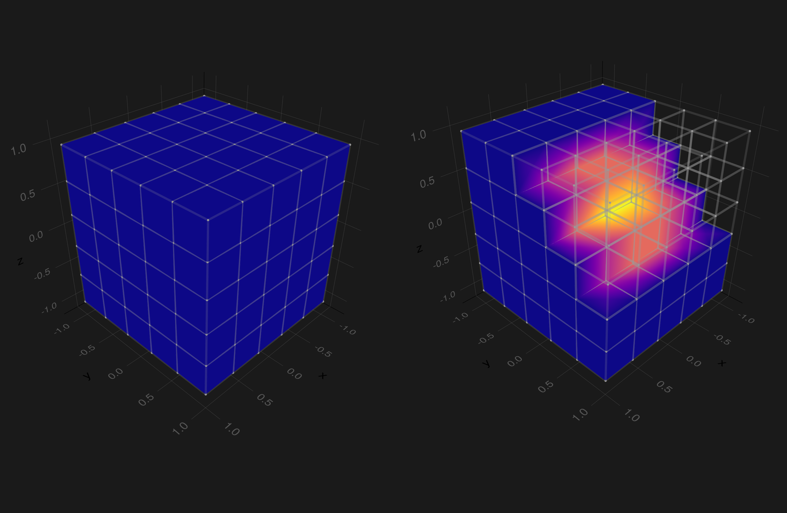

<!--
_class: lead invert
_paginate: false
-->

# **Visualizing PDE Solutions on Unstructured Meshes With Makie.jl**
**A Case Study: FerriteViz.jl**

---

# **Motivation**

## Why FerriteViz?

- needed a visualization tool for basics of finite element course
    - vtk plugins were buggy and most likely not available in Pluto.jl back then
    - interactivity
- also need integrated solution for post-processing and visualization in research projects

---

# **Requirements for the Tool**

- integration between post-processing and visualization
- vector graphics output for publications ✅ CairoMakie.jl
- fast visualization of time-dependent problems ✅ GLMakie.jl
- easy to extend ✅ Makie.jl Recipes
- backend for notebook environment ✅WGLMakie.jl
- support for nonlinear fields and geometry

**Long term goal:** A common interface for PDE visualization.

---

# **Initial Version**

- implement full conforming triangulation of Ferrite.jl elements
- **goal:** support for most basic recipes

Deformed grid with wireframe

Deformation by scalar solution

Elementwise constant data

Arrow plots of vector field

---

# **Initial Version**

Small viewer for asynchronous plotting for time-dependent problems

___

# **Some Technical Details**

Two core algorithms:

1. geometric tessellation kernel to triangulate arbitrary finite element meshes
2. `transfer_solution` kernel that maps FE field onto the tessellation

Both kernels act elementwise.
___

# **Some Technical Details**

1. Many frameworks produce visualization artifacts if quads are used. This stems from the bilinear ansatz of the element.

2. Code simplification: render all faces => no culling

___

# **First Iteration**

**Problem** fields are often discontinuous => conforming treatment fails

___

# **First Iteration**

Example: checker-boarding

___

# **First Iteration**

Problem: Approximation spaces are usually not linear => Low Order Refinement

___

# **First Iteration**

___

# **First Iteration**

Utility functions as e.g. element infos, node numbering, cellset visualization etc.

___

# **Second Iteration**

Clipping + Culling

___

# **Second Iteration**

`ShaderAbstractions.Buffer` for the triangles and physical coords of the triangles

| Makie version | FerriteViz version | plasticity                                | incompressible-elasticity                 | heat-3D-70^3                                |
|---------------|--------------------|-------------------------------------------|-------------------------------------------|---------------------------------------------|
| master        | mk/buffer 817048d  |  17.866 ms (50939 allocations: 3.92 MiB)  |  31.648 ms (98402 allocations: 7.66 MiB)  | 6.100 s (38224 allocations: 1.20 GiB)
| master        | mk/buffer ece12d9  | 17.272 ms (84065 allocations: 6.96 MiB)   | 40.331 ms (218408 allocations: 22.30 MiB) | 8.397 s (4152021 allocations: 1.69 GiB)     |
| master        | master             | 19.213 ms (101569 allocations: 8.10 MiB)  | 47.713 ms (317502 allocations: 28.85 MiB) | 15.122 s (11007449 allocations: 2.34 GiB)   |
| v0.19.2       | master             | 28.692 ms (374363 allocations: 21.19 MiB) | 56.697 ms (557250 allocations: 40.28 MiB) | 70.740 s (603707659 allocations: 29.94 GiB) |

___

# **Work in Progress**

Grids can be of mixed element type and fields can only live on a subdomain

___

# **Next Steps**

- Kernels should work on the GPU, i.e. tessellation and `transfer_solution`
- adaptive tandem tessellation of geometric and algebraic discretization
- superquadrics for tensor valued fields
- isosurface extraction for nonlinear problems

Derive a common interface for PDE Visualizations with Makie => PDEMakie?
